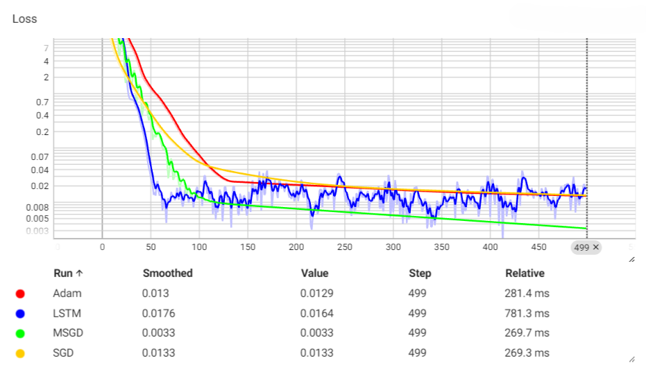
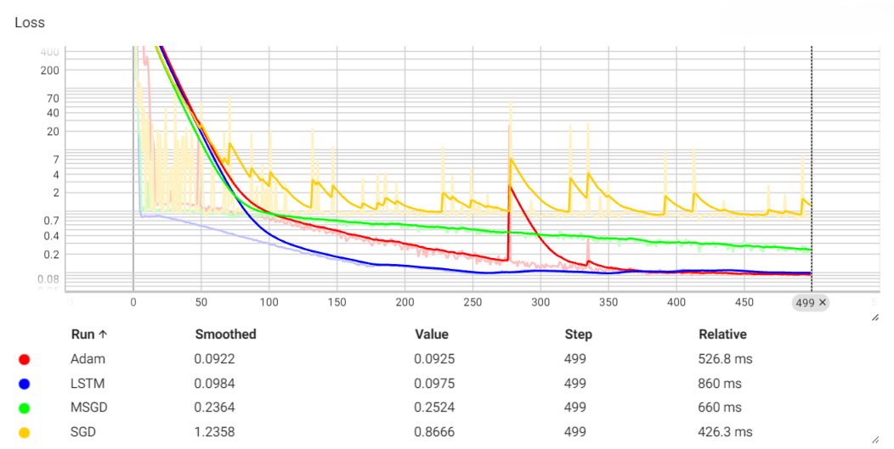
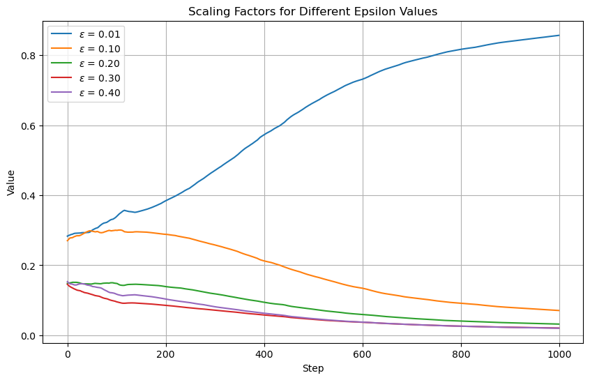
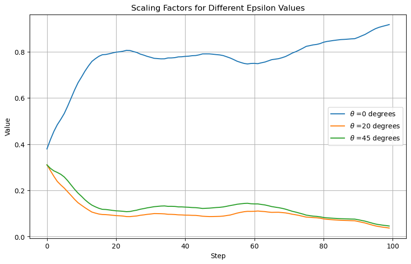

# Learning-to-Optimize

## Abstract
Learning to Optimize (L2O) is a novel Machine Learning approach which aims to substitute the laborious hand-engineering part of definition of optimization methods for Machine Learning Tasks, by formulating the generation of the updates as a task learnable by a Recurrent NN architecture, in this case, an LSTM.   
In this Project and Repository, I aim to provide an implementation of the framework as introduced by the paper [Learning to learn by gradient descent by gradient descent](https://arxiv.org/abs/1606.04474), while further extending the results to a Concurrent Learning Framework where several Optimizees are used in order to cooperate in order to produce better updates for our specific task.

## Table of Contents

- [Approach](#approach)
- [Results](#results)
- [Bibliography](#bibliography)

## Approach
In this implementation, I build optimizees corresponding to two main classes of problems: a LLS Problem, called *QuadraticOptimizee* following the naming sense of the original paper, and a more generic NN-based optimizee, defined by the features and target matrices X and Y, from which the name *XYNNOptimizee*.   
In addition to that, my implementation explores the concurrent framework, building *Initializer* classes corresponding to various concurrent approaches (ex. increasing noise, label poisoning, data concurrency...).   
Finally, I explore slight tweaks of the architecture, by introducing more interpretability to the concurrency by using a "softmaxed" linear layer to learn the weight of a convex combination with which to combine the input gradients, or exploring variations to the gradient preprocessing in view of this concurrency.

## Results
Here are some plots introducing some of the main results of the analysis:

### Performance Comparison with other SOTA Learning Algorithms

Training Loss comparison for LLS Task

Training Loss comparison for NN Task on `load_digits` dataset

As one can see, the trained LSTM architecture performs comparably - if not better - than most hyperparameter-tuned SOTA learning algorithms.
### Interpretability Analysis

Value of scaling factor $\lambda$ for different noise levels in the LLS task

Value of scaling factor $\lambda$ for different image rotation levels in the NN task on `load_digits` dataset

As one can see from the plots, the learned weights for the input gradient combination confirm the intuitive results, with the model gradually assigning higher value to the coefficient of the less noisy optimizee.

## Bibliography

- Andrychowicz, M., Denil, M., Gomez, S., Hoffman, M. W., Pfau, D., Schaul, T., & de Freitas, N. (2016). [Learning to learn by gradient descent by gradient descent](https://arxiv.org/abs/1606.04474). Advances in Neural Information Processing Systems (NeurIPS), 29.